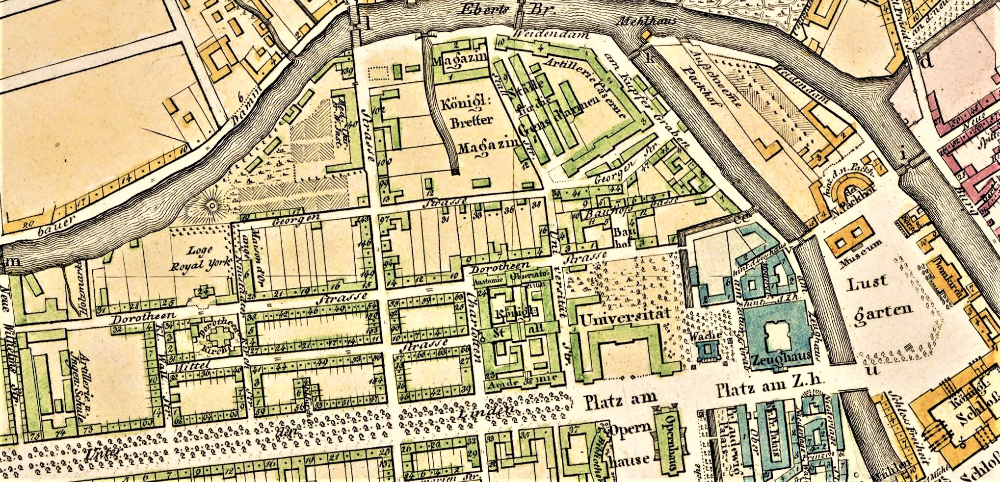

Stadtplan der Berliner Dorotheenstadt um 1825 (Gutzkows Wohngegend zur Knabenzeit)
==================================================================================

Auschnitt aus: Neuester Grundriss von Berlin. Gezeichnet von D[aniel] G[ottlob] Reymann. Berlin: Schropp, 1826.

.. rst-class:: source

  Unbekannt
