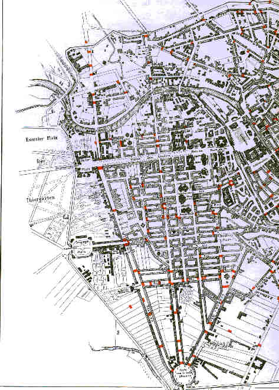

Berliner Barrikaden 1848
========================

Plan von Berlin. Barrikadenbezeichnung mit roten Markierungen.

.. rst-class:: source

  (In: Illustrierte Geschichte der deutschen Revolution 1848/49. Berlin 1988, vordere Buchdeckelinnenseite.)
