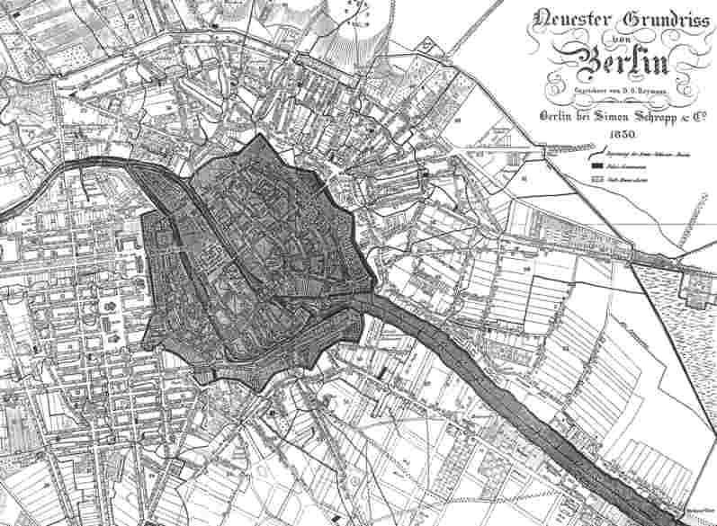

Stadtplan Berlins von 1830
==========================

Gutzkow schickt seine Leser auf den Weg durch die grosse Stadt ...

Ausschnitt aus "Neuester Grundriss von Berlin. Gezeichnet von D. G. Reymann. Berlin: Simon Schropp & Co., 1830".
