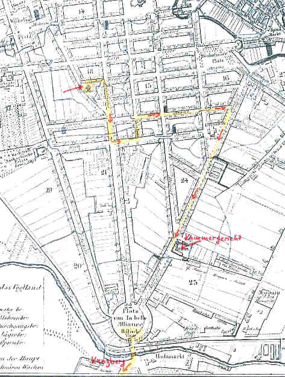

Detail: Böhmische Kirche bis Kammergericht
==========================================

Noch ein scheinbar unmotivierter Umweg macht Sinn ...

Ausschnitt aus "Neuester Grundriss von Berlin. Gezeichnet von D. G. Reymann. Berlin: Simon Schropp & Co., 1830".
