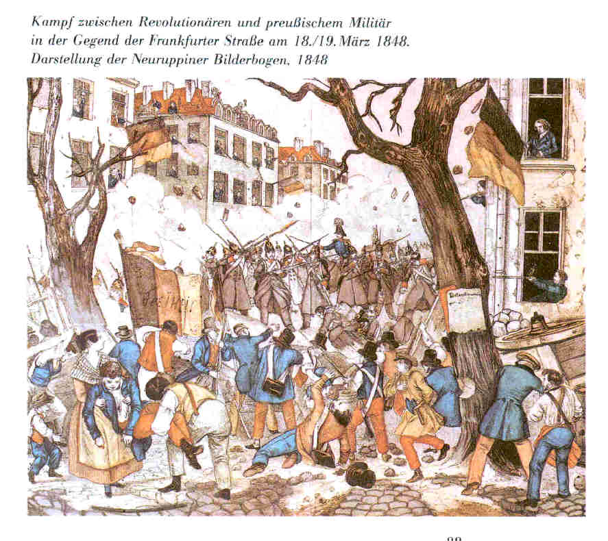

Revolution in Berlin 1848 (1)
=============================

Revolution in Berlin 1848 (1)

.. rst-class:: source

  (Autorenkollektiv Walter Schmidt, Gerhard Becker, Helmut Bleiber, Rolf Dlubek, Siegfried Schmidt, Rolf Weber: Illustrierte Geschichte der deutschen Revolution 1848/49. Berlin 1988, S. 88.)
