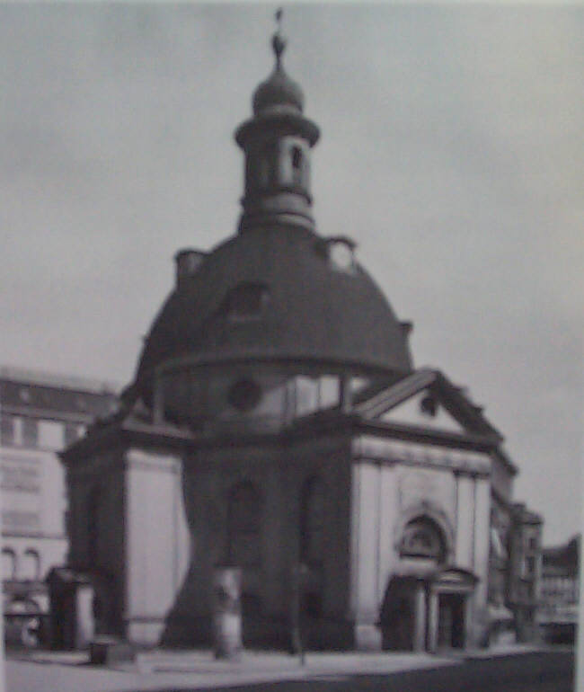

St. Bethlehemskirche
====================

"Böhmische Kirche, Mauer- Ecke Krausenstraße, 1735/37 von Friedrich Wilhelm Dieterichs. Seit 1912 Bethlehemskirche genannt. Staatliche Bildstelle, Berlin"

.. rst-class:: source

  (Rudolf Wolters: Stadtmitte Berlin. Stadtbauliche Entwicklungsphasen von den Anfängen bis zur Gegenwart. Tübingen 1978, S. 69, Foto 71.)
