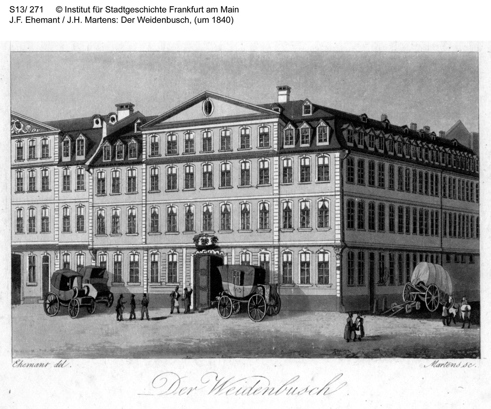

Gasthof „Weidenbusch“
=====================

Gasthof „Weidenbusch“, Steinweg, um 1840. Gezeichnet von J.H. Ehemant, gestochen von J.H. Martens.

.. rst-class:: source

    Institut für Stadtgeschichte, Frankfurt am Main, Signatur S13, Nr. 271.
