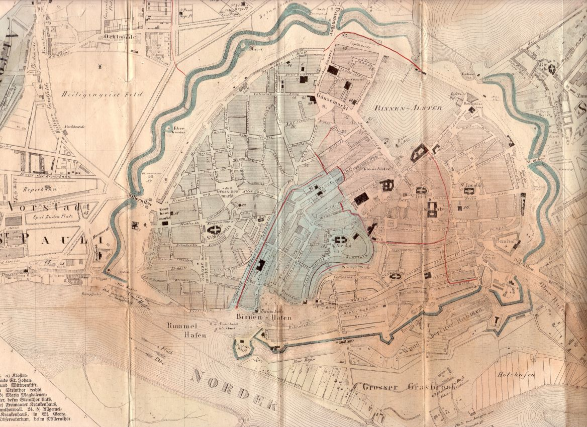

Stadtplan Hamburgs von 1836 (Ausschnitt)
========================================

Stadtplan Hamburgs von 1836 (Ausschnitt)

.. rst-class:: source

  Aus: H[einrich] Meyer: Hamburg und Altona nebst Umgegend. Topographisch-statistisch-historisches Handbuch für Einheimische und Fremde. Mit einem neuen Plan der Stadt nebst Wall-Anlagen. Hamburg u. Itzehoe: Schuberth & Niemeyer, [1836].
