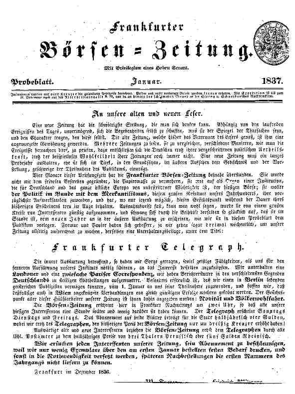

"Frankfurter Börsen-Zeitung", Probeblatt, Jan. 1837
===================================================

Frankfurter Börsen-Zeitung. Probeblatt, Januar 1837.

Das Probeblatt enthält eine Information "An unsere alten und neuen Leser", worin auf die Unterhaltungsbeilage, den "Frankfurter Telegraph", eingegangen wird.
