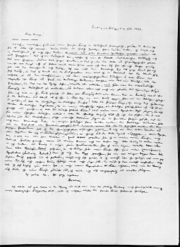

Facsimile eines Börne-Briefes
=============================

Faksimile eines Briefes von Ludwig Börne an Julius Campe, Freiburg, 13. Juli 1832.

.. rst-class:: source

  (Aus: Karl Gutzkow: Börne's Leben. Hamburg: Hoffmann und Campe, 1840.)
