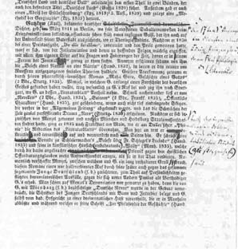

Gutzkows Fahnenkorrektur des Brockhaus (1. S.)
==============================================

Gutzkows Fahnenkorrektur des Eintrags "Gutzkow" im Conversationslexikons von Brockhaus, 1. Seite

.. rst-class:: source

  (aus: Karl Ferdinand Gutzkow. Schriften. Materialien. Hg. von Adrain Hummel und Thomas Neumann. Frankfurt am Main 1998, S. 399.)
