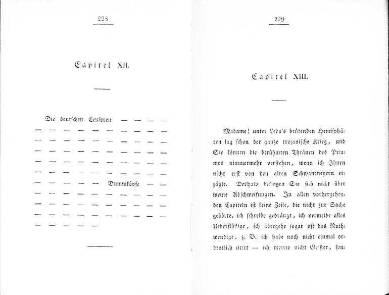

Heinrich Heine, "Ideen. Das Buch Le Grand", Capitel XII/XIII, 1827
==================================================================

Heinrich Heine: Reisebilder. Theil 2: Ideen. Das Buch Le Grand. Hamburg: Hoffmann & Campe, 1827. Capitel XII. / Capitel XIII.

Das "Buch Le Grand" im "zweyten Theil" der "Reisebilder" enthält die berühmten fingierten 'Zensurstriche', die praktisch das gesamte "Capitel XII." ausmachen. Die Zensur wird hier mit ihren eigenen Mitteln witzig bloßgestellt.
