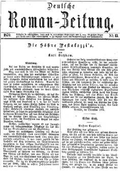

"Deutsche Roman-Zeitung": "Die Söhne Pestalozzi's", 1870
========================================================

Deutsche Roman-Zeitung, Nr. 13, 1870.

In dieser Nummer erschien die erste Lieferung von Gutzkows Roman "Die Söhne Pestalozzi's". Auf der Seite zu lesen sind die "Einleitung" und der Anfang des "Ersten Buches".
