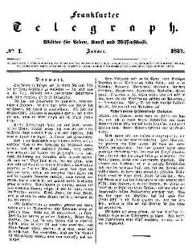

"Frankfurter Telegraph", Jan. 1837
==================================

Frankfurter Telegraph. Blätter für Leben, Kunst und Wissenschaft. Nr. 1, Januar 1837.

Gutzkow war der eigentliche Redakteur der Zeitung, durfte seinen Namen aber aus Zensurgründen nicht nennen.

Vgl. die Einträge Frankfurter TelegraphZensur
