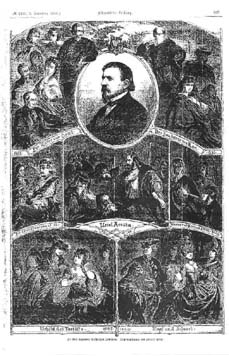

"Illustrirte Zeitung": Zu Gutzkows 25jährigem Jubiläum, Sept. 1864
==================================================================

"Zu Karl Gutzkow's 25jährigem Jubiläum. Originalzeichnung von Herbert König."

.. rst-class:: source

  (Erschienen in: Illustrirte Zeitung. Nr. 1105, 3. September 1864, S. 165.)

Die Zeichnung enthält Illustrationen zu den Romanen "Die Ritter vom Geiste", "Der Zauberer von Rom", vor allem aber zu den Dramen "Uriel Acosta", "Werner", "Zopf und Schwert", "Das Urbild des Tartüffe" und "Der Königsleutnant".
