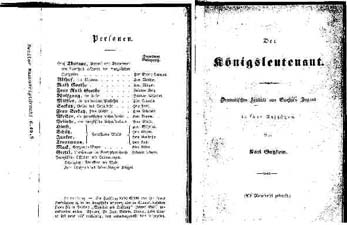

Der Königsleutnant", 2. Manuskriptdruck, 1849
=============================================

"Der Königsleutnant". Personenverzeichnis und Titelblatt des zweiten Manuskriptdrucks, der im September 1849 entstanden ist.

.. rst-class:: source

  (Näheres in Wolfgang Raschs "Bibliographie Karl Gutzkow", Bd 1, S. 580, Nr. 6.49.3.)
