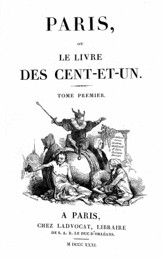

"Livre des Cent-et-un", Serientitel, 1831-34
============================================

"Paris, ou Le Livre des Cent-et-un", Serientitel, 1831-34, 15 Bde, Paris.

Vignette gez. von Henry Monnier, gest. von Charles Thompson.

Vgl. auch den entsprechenden Artikel
