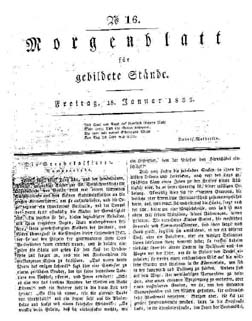

"Morgenblatt": "Die Sterbekassierer", Jan. 1833
===============================================

Morgenblatt für gebildete Stände. Nr. 16, 18. Januar 1835: Anfang des Abdrucks von der Erzählung "Die Sterbecassierer".

Vgl. dazu den Text
