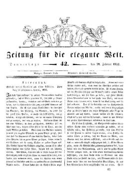

"Zeitung für die elegante Welt", Rezension der "Narrenbriefe"
=============================================================

Rezension von Gutzkows "Briefen eines Narren an eine Närrin" in Laubes "Zeitung für die elegante Welt", 28. Februar 1833.

Vgl. dazu in Kürze hier den Text des Romans in der Buchausgabe von 1832.
