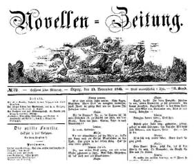

Novellen-Zeitung": "Die stille Familie", Nov. 1845
==================================================

Novellen-Zeitung. Nr. 72, 12. November 1845.

Diese Nummer der in Leipzig erscheinenden Zeitung enthält unter anderem den ersten Aufzug des Lustpiels "Die stille Familie" von Karl Gutzkow. Die weiteren beiden Aufzüge folgen in den Nummern 73 und 74.
