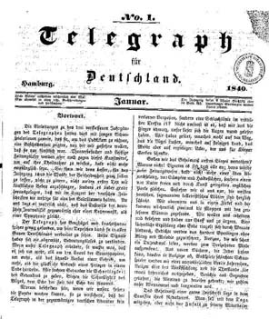

"Telegraph für Deutschland": "Vorwort", Jan. 1840
=================================================

Telegraph für Deutschland, No. 1, Januar 1840.

Seit 1838 gibt Gutzkow in Hamburg dieses Blatt heraus. Mitarbeiter sind unter anderen Friedrich Saß, Karl Goedeke, Friedrich Hebbel, Georg Herwegh, Alexander Jung, Heinrich Albert Oppermann, Friedrich Engels, Levin Schücking und Franz Dingelstedt.

Vgl. auch den Eintrag
