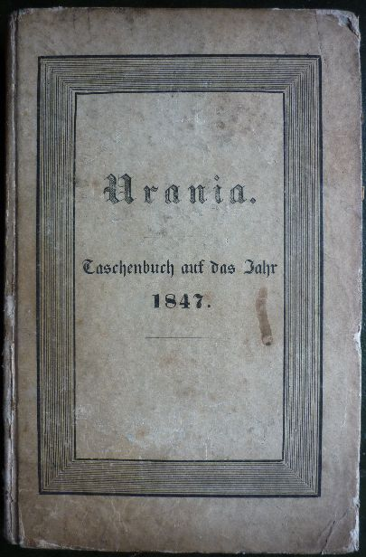

Urania 1847. Titelseite.
========================

Titelseite des Brockhausschen Jahrbuchs "Urania" von 1847, in dem Gutzkow seine Erzählung "Imagina" zuerst veröffentlichte.

.. rst-class:: source

  (Urania. Taschenbuch auf das Jahr 1847. N.F. Jg. 9. Leipzig: Brockhaus, 1847.)
