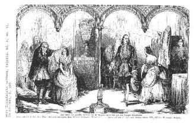

"Illustrirte Zeitung": Illustration zu "Das Urbild des Tartüffe", März 1845
===========================================================================

Illustration zu einer "Scene aus dem 1. Act" vom Drama "Das Urbild des Tartüffe".

.. rst-class:: source

  (In: Illustrirte Zeitung [Leipzig]. Bd 4, Nr. 91, 29. März 1845, S.205.)
