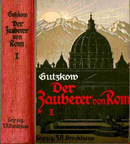

Einbandillustration zum "Zauberer von Rom", 1922
================================================

Einbandillustration zum "Zauberer von Rom", 1922

Buchrücken und vordere Einbandseite zur 15. Aufl. des Romans "Der Zauberer von Rom" (Bd. 1, Leipzig: F. A. Brockhaus, 1922)
