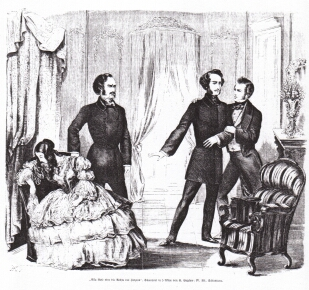

"Ella Rose", Schlussszene (1856)
================================

Schlussszene aus "Ella Rose oder die Rechte des Herzens". Holzstich von H. K., 1856

.. rst-class:: source

  Aus: Illustrirte Zeitung. Leipzig. Nr. 665, 1. April 1856
