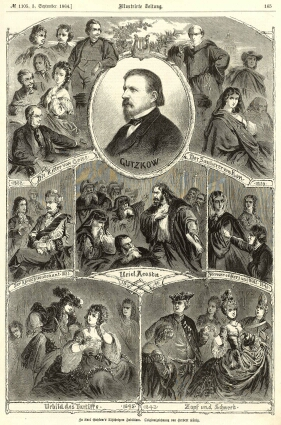

Figurentableaux aus Gutzkows Werken (1864)
==========================================

Figurentableaux aus Gutzkows Werken. Zeichnung von Herbert König. Herbert König: Zu Karl Gutzkow's 25jährigem Jubiläum. Holzstich, 1864

.. rst-class:: source

  Aus: Illustrirte Zeitung. Leipzig. Nr. 1105, 3. September 1864
