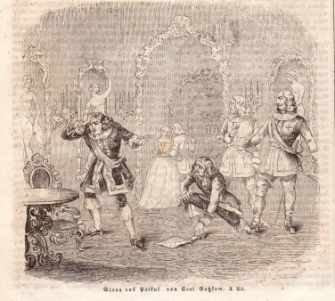

"Patkul", Szene aus dem 3. Akt (1844)
=====================================

Szene aus dem III. Akt von "Patkul". Anon. Holzstich, 1844

.. rst-class:: source

  Aus: Illustrirte Zeitung. Leipzig. Bd. II, 17. Februar 1844
