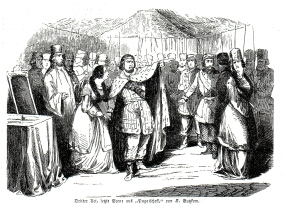

"Pugatscheff", letzte Szene aus dem 3. Akt (1845)
=================================================

"Pugatscheff", letzte Szene aus Akt III. Anon. Holzstich, 1845

.. rst-class:: source

  Aus: Illustrirte Zeitung. Leipzig. Nr. 84, 8. Februar 1845
