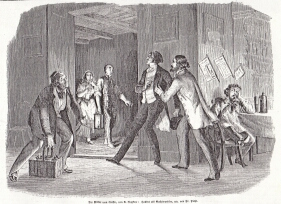

"Die Ritter vom Geiste", Hackert als Nachtwandler (1851)
========================================================

Hackert als Nachtwandler in die "Ritter vom Geiste". Zeichnung von Friedrich Pecht. Holzstich, 1851

.. rst-class:: source

  Aus: Illustrirte Zeitung. Leipzig. Bd. XVII. Nr. 431, 4. Oktober 1851
