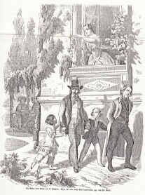

"Die Ritter vom Geiste", Olga wirft eine weiße Rose herab (1851)
================================================================

Olga, die eine weiße Rose herabwirft, in "Die Ritter vom Geiste". Zeichnung von Friedrich Pecht. Holzstich, 1851

.. rst-class:: source

  Aus: Illustrirte Zeitung. Leipzig. Bd. XVII. Nr. 433, 18. Oktober 1851
