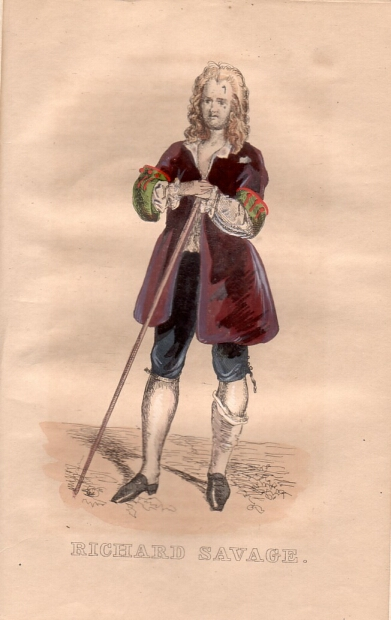

Richard Savage aus "Richard Savage" (Kostümbild, 1841)
======================================================

Richard Savage. Handkollorierter Holzstich zu "Richard Savage", 1841

.. rst-class:: source

  Aus: Taschenbuch dramatischer Originalien. Mit einem Bildnis und acht colorirten Costumbildern. Hrsg. von Franck. 5. Jg. Leipzig: Brockhaus, 1841
