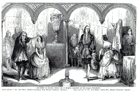

"Das Urbild des Tartüffe", zwei Szenenbilder (1845)
===================================================

Zwei Szenenbilder von der Aufführung von "Das Urbild des Tartüffe" am Leipziger Stadttheater. Anon. Holzstich, 1845

.. rst-class:: source

  Aus: Illustrirte Zeitung. Leipzig. Nr. 91, 19. März 1845
