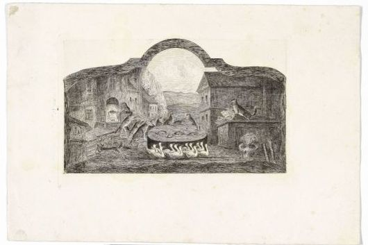

Wo der Wolf den Gänsen predigt (1817): Zu "Briefe eines Narren an eine Närrin"
==============================================================================

Wo der Wolf den Gänsen predigt. Radierung von Emil Hütter, 1817.
Diese Radierung bildet ein Wiener Hausschild aus der Zeit der Gegenreformation ab, auf das Gutzkows ,Narr‘ in den "Briefen eines Narren an eine Närrin" hinweist (120,15).

.. rst-class:: source

  © Wien Museum (Inventar Nr. HWW 83263). Durch freundliche Vermittlung von Herrn Helmut Selzer.
