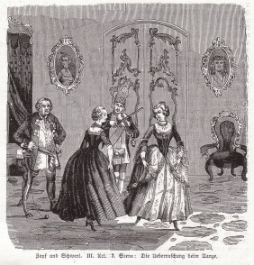

"Zopf und Schwert", Szene aus dem 3. Akt (1844)
===============================================

Die Überraschung beim Tanze. Szene aus "Zopf und Schwert", III, 2. Anon. Holzstich, 1844

.. rst-class:: source

  Aus: Illustrirte Zeitung. Leipzig. Bd. III, Nr. 67, 12. Oktober 1844
