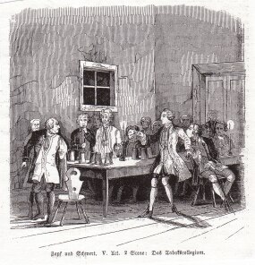

"Zopf und Schwert", Szene aus dem 5. Akt (1844)
===============================================

Das Tabakscollegium. Szene aus "Zopf und Schwert", V, 2. Anon. Holzstich, 1844

.. rst-class:: source

  Aus: Illustrirte Zeitung. Leipzig. Bd. III, Nr. 67, 12. Oktober 1844
