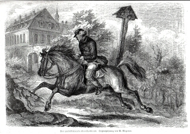

"Der Zauberer von Rom", der zurückkehrende Kronsyndikus (1859)
==============================================================

Der zurückkehrende Kronsyndicus, aus "Der Zauberer von Rom". Zeichnung von Wilhelm Wegener. Holzstich, 1859

.. rst-class:: source

  Aus: Die Gartenlaube. Leipzig. Nr. 34, [August] 1859
