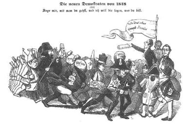

Die neuen Demokraten, 1848
==========================

"Die neuen Demokraten von 1848, oder: Sage mir, mit wem zu gehst, und ich will dir sagen, wer du bist."

.. rst-class:: source

  (Karikatur aus dem "Eulenspiegel", 1848. In: Illustrierte Geschichte der deutschen Revolution 1848/49. Berlin 1988, S. 186.)
