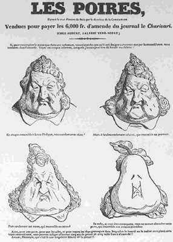

Metamorphosen zur Birne: Louis Philippe
=======================================

Karikatur von Louis Philippe Artikel

.. rst-class:: source

  (Charles Philipon, Metamorphosen zur Birne, Titel zu Charles Philipons programmatischem Nachruf auf "La Caricature" in ihrer letzten Ausgabe Nr. 251 vom 27.8.1835, in: J. J. Grandville. Karikatur und Zeichnung. Ein Visionär der französischen Romantik. Ausstellungskatalog, Karlsruhe 2000, S. 14.)

Vgl. auch den entsprechenden Artikel
