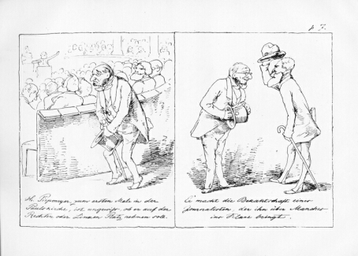

Hr. Piepmeyer, zum ersten Male in der Paulskirche
=================================================

Hr. Piepmeyer, zum ersten Male in der Paulskirche, ist ungewiß, ob er auf der Rechten oder Linken Platz nehmen soll. / Er macht die Bekanntschaft eines Journalisten, der ihn über Manches ins Klare bringt.

.. rst-class:: source

  (Aus: [Johann Heinrich Detmold und Adolf Schrödter:] Thaten und Meinungen des Herrn Piepmeyer[,] Abgeordneten zur constituirenden Nationalversammlung zu Frankfurt am Main. [Frankfurt/M.: Jügel, 1848-49, 1. Lfg.], p. 7.)

Der Abgeordnete Piepmeyer wird von dem Journalisten z. B. darüber "ins Klare" gebracht, dass es zum Image der "Linken" gehört, den runden Kalabreser und einen Vollbart zu tragen. Piepmeyer tauscht seinen mit der "Rechten" assoziierten Zylinder entsprechend aus und lässt sich einen Bart stehen.
