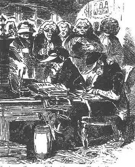

Hamburger Zensoren, 1847
========================

"Hamburger Zensoren".

.. rst-class:: source

  (Federzeichnung von Theodor Hosemann, 1847. In: Illustrierte Geschichte der deutschen Revolution 1848/49. Berlin 1988, S. 18.)
