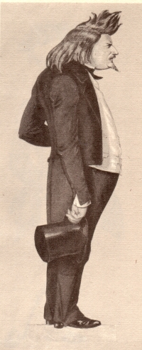

Gutzkow 1850, Karikatur von Arthur von Ramberg und Friedrich Pecht
==================================================================

Eines von 50 Zentimenter hohen, in Deckfarben gemalten Bilder für die am 5. März 1850 in Dresden aufgeführte Fastnachtsposse "Die Monumentskonkurrenz" von Friedrich Rudolph Meyer, die im Rahmen eines Festes der Dresdener Montagsgesellschaft stattfand.

.. class:: source

  (Die Dresdener Montagsgesellschaft und ihre Monumentskonkurrenz. Dresden, Verein für Bücherfreunde, 1929. Bl. 15)
