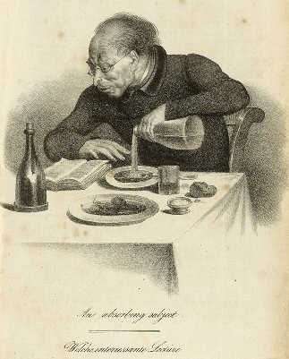

Leser (Welche interessante Lektüre)
===================================

Leser (Welche interessante Lektüre).

.. rst-class:: source

  (Karikatur aus: Europa. Chronik der gebildeten Welt. 1836, Bd 4. Stuttgart: Literatur-Comptoir, 1836. Nach S. 616.)
