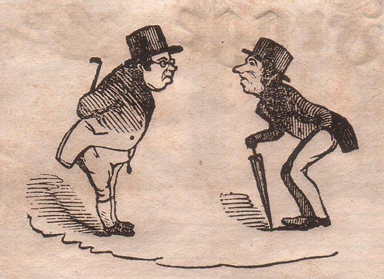

Müller und Schultze
===================

Müller und Schultze, das Berliner Spießbürgerpaar des „Kladderadatsch“.

.. rst-class:: source

  (In: Kladderadatsch. Humoristisch-satyrisches Wochenblatt. Berlin. Nr. 11, 5. März 1854, S. 43.)
