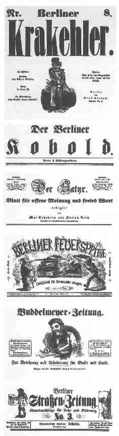

Politisch-satirische Journale in Berlin, 1848/49
================================================

In Berlin verbreitete politisch-satirische Journale aus der Zeit der Revolution 1848/49.

.. rst-class:: source

  (In: Illustrierte Geschichte der deutschen Revolution 1848/49. Berlin 1988, S. 186.)
