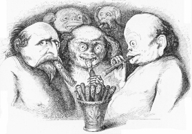

Gutzkow raucht Therese von Bacheracht. Karikatur 1846
=====================================================

Gutzkow raucht Therese von Bacheracht. Gez. und gest. von Alexander von Ungern-Sternberg, Karikatur 1846.

.. rst-class:: source

  (Aus: Tutu. Phantastische Episoden und poetische Exkursionen von A. von [Ungern-] Sternberg. Mit Illustrationen von Sylvan [d.i. A. von Ungern-Sternberg]. Meersburg: Hendel, 1936, S. 155. [Reprint der Ausgabe Leipzig 1846].)

Ungern-Sternbergs Roman erschien zuerst 1846. Die Erläuterung dieser Abbildung in der Ausgabe von 1936 (S. 217) weist den Raucher links im Bild zwar nicht als Karl Gutzkow aus, aber die Gerauchte als Therese von Bacheracht.
