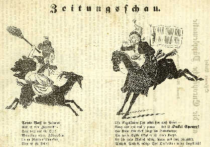

Berliner Zeitungsschau 1850 (I)
===============================

Berliner Zeitungsschau 1850 - Tante Voß u. Onkel Spener.

.. rst-class:: source

  (Karikatur aus: Buddelmeyer-Zeitung. Berlin. Nr. 11. u. 12, 11. Februar 1850.)
