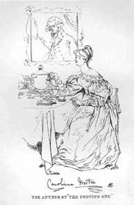

Frauenfrisur: Mrs. Norton
=========================

Portrait der Schriftstellerin Caroline Norton.

In der ersten Hälfte der 30er Jahre brachte die Monatsschrift "Fraser's Magazine" eine Reihe illustrierter Portraitskizzen von literarischen Persönlichkeiten des Tages heraus. Der Zeichner Daniel Maclise erfasst dabei die 'Mode des Tages'. Das Kleid der Mrs Norton zeigt die für die frühen 30er Jahre typischen abgesenkten Schultern und 'Hammelkeulenärmel'.
