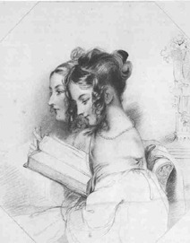

Frauenfrisuren: Locken
======================

Frauenfrisuren: Korkenzieherlocken. Illustration aus Fisher's "Drawing-room Scrap-book" (hg. von Letitia Landon).

Für die 30er Jahre typische aufgesteckte Frauenfrisur.
