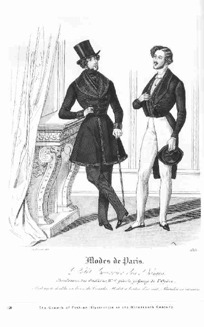

Herrenmode: der Elegante
========================

Herrenmode: der Elegante.

Modeillustrationen waren Bestandteil vieler Journale, selbst wenn sie nicht als Modezeitschriften erschienen. Solche Abbildungen fanden sich zum Beispiel regelmäßig auch in Lewalds "Europa" und der "Zeitung für die elegante Welt". Vorbildlich war dabei nicht nur die Pariser und Londoner Mode, sondern selbst die Modekupfer wurden oft aus französischen und englischen Magazinen in die deutschen übernommen. So zum Beispiel bediente sich die "Europa" etlicher Illustrationen aus dem "Petit Courrier des Dames", aus dem auch die obige Abbildung entnommen ist.
