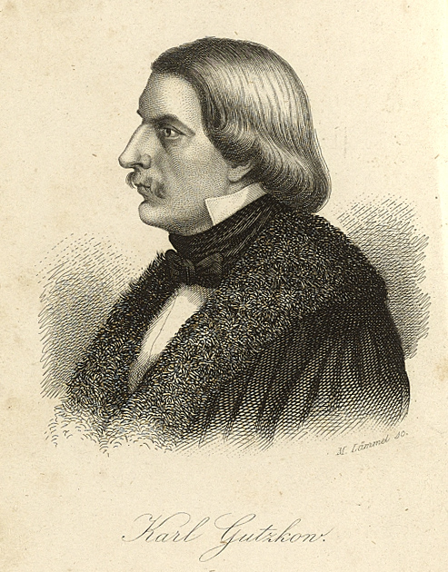

Gutzkow 1846, nach einer Zeichnung von Jules Lunteschütz gest. von M. Lämmel
============================================================================

Gutzkow 1846, nach einer Zeichnung von Jules Lunteschütz gest. von M. Lämmel

.. rst-class:: source

  (Carl Gutzkow: [Werkauszüge.] Mit Porträt. 5., neu bearb. Aufl. Leipzig: Verlag der modernen Klassiker [um 1855])
